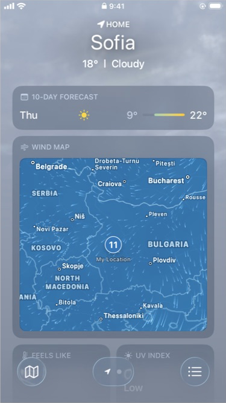
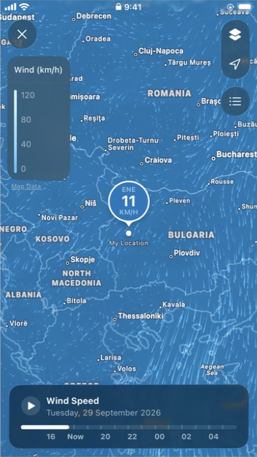

# Apple Weather — Wind Map на iPhone SE 2

Наблюдение на **реалния свързан iPhone SE (2nd generation)** на 29 септември 2026 г. Разгледани са вградената Wind Map картичка, картата на цял екран, всички видими нейни бутони, менюто за слоеве, списъкът с места и времевата линия.

**[Отвори галерията](gallery.html)** · **[Каталог на всички кадри](screenshots.md)** · **[Регистър на заснемането](capture-log.json)** · **[Технически данни](metadata.json)**

## Двата основни изгледа

| Вградена картичка | Карта на цял екран |
| --- | --- |
|  |  |

## Среда и произход на изображенията

- Устройство: iPhone SE 2, идентификатор на модела `iPhone12,8`.
- Система: iOS **26.6.1**, build **23G83**, потвърдени чрез Xcode CoreDevice.
- Приложение: Apple Weather; интерфейс на английски; вятър в **km/h**; портретна ориентация.
- Проверени места: **My Location / Sofia** и вече съществуващото **San Francisco**.
- Сесия: приблизително **17:27–17:35 Europe/Sofia**. Точните времена на кадрите са в UTC в регистъра. Показваното `9:41` в огледалния екран не е часовникът на заснемането.
- Физически дисплей: **750 × 1334 px**, мащаб 2, логическа площ **375 × 667 pt**.
- Управление и заснемане: **iPhone Mirroring** на Mac. Оригиналите в `source-captures/` са JPEG кадри на прозореца, **392 × 713 px**. Кадрите в `screenshots/` са PNG, изрязани до **375 × 667 px** с правоъгълник `(x=8, y=38, width=375, height=667)`.
- Съдържанието на екрана не е ретуширано, дорисувано или увеличавано. Това са кадри от огледалния преглед, а не директни iOS скрийншоти с физическата резолюция 750 × 1334. В някои вторични кадри се вижда курсорът на Mirroring; основните 26 и 27 са чисти след изрязването.

Данните се обновяваха по време на наблюдението: Sofia премина от **12 km/h, NE, 32 km/h gusts** към **11 km/h, ENE, 29 km/h gusts**. Разликите между кадрите не са различни фиксирани състояния на дизайна.

## Вградена Wind Map картичка

Картичката е част от вертикално скролиращата прогноза. В наблюдавания ред се намира под **10-DAY FORECAST** и над **FEELS LIKE / UV INDEX**. По-надолу има отделна числова картичка **WIND** с компас, скорост и пориви; тя е различен компонент от **WIND MAP**.

Обвивката е полупрозрачен сиво-син панел със заоблени ъгли. Горният ред съдържа малка икона за вятър и приглушен надпис **WIND MAP** с главни букви. Под него има отделно заоблен правоъгълник на картата. Виждат се синият слой за вятър, светли движещи се щрихи, контури на държави и пътища, имена на места и малък кръгъл маркер със стойност `11` или `12` над **My Location**.

В този изглед няма собствена легенда, Play/Pause, времева линия или меню за слоеве. Докосването на картата отваря пълния екран. Долните плаващи бутони на Weather — карта, индикатор/избор на град и списък — принадлежат на основния екран, а не на Wind Map картичката.

При скролиране заглавието **Sofia / 18° | Cloudy** остава горе. Картичката се свива/отрязва при преминаване под фиксираната горна област: [кадър 23](screenshots/23-inline-after-close.png), [кадър 24](screenshots/24-inline-scroll-clipping.png). В 24 заглавието WIND MAP остава видимо над намалена по височина част от картата. Не е измерван точният алгоритъм на това преоформяне.

## Карта на цял екран

Картата запълва видимата площ, включително фона зад status bar. Няма отделно навигационно заглавие. Всички инструменти са плаващи полупрозрачни тъмносини панели с бели или светлосиви символи.

- **Горе вляво:** кръгъл бутон `×` за затваряне.
- **Под него:** вертикална легенда **Wind (km/h)**, тънка цветна скала и стойности **0, 40, 80, 120** отдолу нагоре. Под панела има подчертан надпис **Map Data**.
- **Горе вдясно:** обща вертикална капсула с бутон за слоеве отгоре и стрелка за местоположение отдолу. Под нея е отделен кръгъл бутон със списък.
- **Върху мястото:** голям кръгъл балон със светъл контур, посока (`NE` / `ENE`), голяма скорост (`12` / `11`) и `KM/H`. Под балона има връх, точка върху картата и надпис **My Location**. След докосване на свободна област маркерът може да стане малък кръг само със скоростта.
- **Долу:** широк заоблен панел с Play/Pause, **Wind Speed**, дата, времева линия и часови отметки.

Светлите щрихи за вятъра се движат и при видим бутон **Play**, т.е. при паузирано възпроизвеждане на времевата линия. Play/Pause и движението на частиците са отделни наблюдавани поведения. Статичните кадри показват различни фази, но не запазват самото движение.

### Приблизителна геометрия

Размерите по-долу са измерени визуално от изрязания **375 × 667 px** кадър 27. Те са ориентир за сравнение, а не извлечени стойности от кода на Apple. Началото на координатите е горе вляво на екрана; възможно отклонение около 2–4 px.

| Елемент | Приблизителен правоъгълник `(x, y, w, h)` |
| --- | --- |
| Бутон затваряне | `(10, 28, 44, 44)` |
| Капсула слоеве + местоположение | `(321, 28, 44, 88)` |
| Бутон списък | `(321, 125, 44, 44)` |
| Легенда | `(10, 82, 93, 182)` |
| Долен панел | `(13, 562, 350, 95)` |
| Времева линия | `(31, 621, 313, 6)` |
| Меню слоеве, кадър 03 | `(117, 29, 247, 186)` |
| Панел Your Locations, кадър 09 | `(9, 324, 358, 336)` |
| Външна inline картичка, кадър 26 | `(20, 225, 335, 336)` |
| Карта в inline картичката, кадър 26 | `(32, 262, 310, 286)` |

Ъглите на малките панели изглеждат с радиус около 16–20 pt; менюто и горният край на долния панел с места са по-силно заоблени. Текстът е системен sans-serif на вид, с по-дебели заглавия и по-приглушени вторични редове. Точни имена на шрифтове, material стилове и RGB цветове не са извличани.

## Контроли и проверено поведение

| Контрол / жест | Действие и наблюдаван резултат | Кадри |
| --- | --- | --- |
| Inline карта | Докосване отваря Wind Map на цял екран. | [01](screenshots/01-inline-wind-map.png), [02](screenshots/02-fullscreen-wind-map.png) |
| `×` горе вляво | Затваря картата и връща прогнозата с Wind Map картичката. | [23](screenshots/23-inline-after-close.png) |
| Слоеве | Отваря меню с Precipitation, Temperature, Air Quality и Wind. Активният слой има отметка. | [03](screenshots/03-map-layers-menu.png) |
| Wind | Връща синия слой, частиците, легендата km/h и панела Wind Speed. | [07](screenshots/07-wind-close-scale.png) |
| Precipitation | Сменя палитрата и легендата; долу се появява Forecast с контроли 1h / 12h. | [04](screenshots/04-layer-precipitation.png) |
| Temperature | Показва цветна температурна карта и легенда; няма долна времева линия в наблюдавания изглед. | [05](screenshots/05-layer-temperature.png) |
| Air Quality | За Sofia показва Unavailable и маркер `--`; картата е сива и без времева линия. | [06](screenshots/06-layer-air-quality.png) |
| Стрелка за местоположение | От San Francisco връща картата към My Location / Sofia. След местене също връща фокуса към мястото. | [10](screenshots/10-selected-san-francisco.png), [15](screenshots/15-location-recenter.png) |
| Списък вдясно | Отваря долен панел Wind / Your Locations и затъмнява картата зад него. | [09](screenshots/09-locations-list.png) |
| Ред с град | Изборът на San Francisco затваря панела и премества картата към града. | [10](screenshots/10-selected-san-francisco.png) |
| `×` в Your Locations | Затваря само панела; картата остава отворена. Проверено и в края на сесията. | [09](screenshots/09-locations-list.png), основен вид [27](screenshots/27-fullscreen-clean.png) |
| Play / Pause | Play се заменя с две вертикални черти; повторното натискане връща триъгълника. | [11](screenshots/11-timeline-playing.png), [12](screenshots/12-timeline-paused.png) |
| Плъзгане по времето | Премества белия прогрес; при придвижване вдясно датата става Wednesday, 30 September 2026. | [13](screenshots/13-timeline-scrub-forward.png) |
| Докосване в началото на линията | Премества позицията вляво и връща Tuesday, 29 September 2026. | [14](screenshots/14-timeline-start.png) |
| Докосване на свободна карта | Скрива долния времеви панел; следващо докосване на същото място го връща. Легендата и горните бутони остават. | [21](screenshots/21-map-tap-timeline-hidden.png), [22](screenshots/22-map-tap-timeline-restored.png) |
| Двукратно докосване | Увеличава географския мащаб около докоснатото място. | [17](screenshots/17-map-double-tap-zoom.png) |
| Влачене върху карта | Премества картографското съдържание; плаващите контроли остават на място. | [18](screenshots/18-map-drag-pan.png) |
| Голям балон за вятъра | Еднократно докосване не отвори допълнителен панел при този опит. | [08](screenshots/08-marker-tap-no-sheet.png) |
| Заглавие Wind Speed / легенда Wind (km/h) | Докосването им не отвори меню или избор на единици при проверката. | Основен вид [27](screenshots/27-fullscreen-clean.png) |
| Map Data | Надписът е видим; при няколко опита не се отвори страница с източници. Докосването в тази зона се държа като докосване на картата спрямо долния панел. Предназначението на връзката не е потвърдено чрез отворена страница. | [19](screenshots/19-map-data-tap-no-page.png), [20](screenshots/20-timeline-hidden-after-label-taps.png) |

### Времева линия

Заглавието е **Wind Speed**. Под него се изписва денят от седмицата и пълната дата. Вдясно няма превключвател между скорост и пориви в наблюдавания Wind изглед. Поривите се виждат в списъка с места.

В ранните кадри отметките са `15 · Now · 19 · 21 · 23 · 01 · 03`; по-късно са `16 · Now · 20 · 22 · 00 · 02 · 04`. Това са конкретните видими етикети по време на сесията, а не доказателство за фиксиран хоризонт. Точният часови обхват и часовата зона на прогнозата не са установени. Изборът на San Francisco запази същите видими часови отметки в този преглед.

При избрана бъдеща позиция датата и белият прогрес се променят, но балонът на San Francisco остана `6 KM/H` в заснетите кадри. От това не може да се заключи дали маркерът винаги показва текуща стойност или стойността просто не се е променила за избрания час. Не е измервана скоростта на автоматично възпроизвеждане или поведението при края на цикъла.

### Панел Your Locations

Горният ред е икона за вятър, **Wind**, подзаглавие **Your Locations** и кръгъл бутон `×`. Вътре има по-светъл заоблен блок с два реда, разделени с тънка линия. Вляво стоят името и `скорост km/h, пориви km/h gusts`; вдясно — стрелка и буквена посока. В [кадър 09](screenshots/09-locations-list.png) са показани:

- **My Location:** `12 km/h, 32 km/h gusts`, `NE`.
- **San Francisco:** `6 km/h, 7 km/h gusts`, `S`.

## Обхват и ограничения

Всички видими контроли на **Wind** изгледа са разгледани или докоснати; резултатът е описан по-горе, включително опитите без допълнителен екран. Четирите слоя са отворени, за да се документира менюто на Wind Map. Вътрешните специфични контроли на другите слоеве, като `1h / 12h` за валежи, не са отделен обект на тази проверка.

Мултитъч pinch/rotation, дълго задържане, landscape, VoiceOver и други езици/визуални настройки не са проверявани. Няма измислени резултати за тях. Вертикалният scroll през Mirroring не премести пълноекранната карта в един опит ([16](screenshots/16-scroll-input-no-pan.png)); влаченето я премести успешно. Това е ограничение на конкретния входен метод и не описва всички възможни жестове върху самия телефон.

Към края Weather е оставено на **Wind Map / My Location**, с видима времева линия и паузирано възпроизвеждане. Не са добавяни или изтривани места и не са променяни настройки на телефона. В репото е добавена само тази референтна папка; няма промени по кода на приложението и не е необходим Debug build или преинсталиране на симулаторите.

## Съдържание на папката

- `README.md` — наблюдения, разположение, контроли и ограничения.
- `gallery.html` — офлайн галерия с 22 подбрани кадъра, филтри и увеличение.
- `screenshots.md` — всички 28 кадъра с вложени изображения и бележки.
- `screenshots/` — 28 PNG кадъра само на екрана, 375 × 667 px.
- `source-captures/` — 28 оригинални JPEG кадъра на прозореца.
- `capture-log.json` — време, действие и резултат за всеки кадър.
- `metadata.json` — среда, метод на заснемане и правоъгълник на изрязване.
- `manifest.json` — файлове, размери и SHA-256 за проверка на целостта.
- `prepare_reference.py` — възпроизводимо изрязване и генериране на галерията/каталога; използва Python 3 и системния macOS `sips`.

За регенериране изпълни `python3 prepare_reference.py` в тази папка. Скриптът използва вече записаните кадри и не управлява телефона.
