# Всички заснети състояния

[Описание и контроли](README.md) · [Галерия](gallery.html)

Екраните са изрязани от оригиналните Mirroring кадри. Под всяко изображение има записаното действие/наблюдение.

## 00. 00-initial-fullscreen

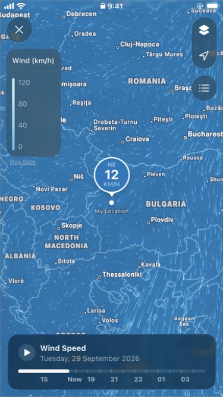

Initial full-screen capture before the timestamped capture log was started.

Запис: Initial full-screen capture before the timestamped capture log was started.

Време UTC: не е записано за първоначалния кадър. [Оригинален кадър](source-captures/00-initial-fullscreen.jpg).

## 01. 01-inline-wind-map

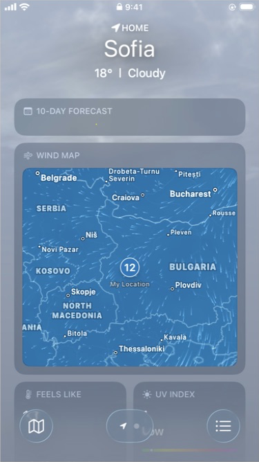

Wind Map card embedded in the Sofia forecast, before opening.

Запис: Wind Map card embedded in the Sofia forecast, before opening.

Време UTC: 2026-09-29T14:27:31.309Z. [Оригинален кадър](source-captures/01-inline-wind-map.jpg).

## 02. 02-fullscreen-wind-map

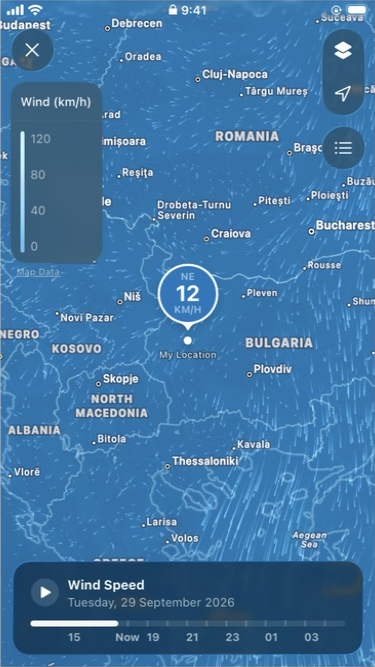

Full-screen Wind Speed map opened by tapping embedded Wind Map card.

Запис: Full-screen Wind Speed map opened by tapping embedded Wind Map card.

Време UTC: 2026-09-29T14:27:36.548Z. [Оригинален кадър](source-captures/02-fullscreen-wind-map.jpg).

## 03. Меню за слоеве

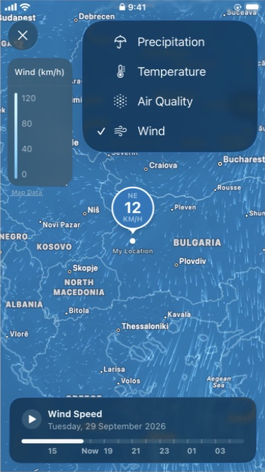

Precipitation, Temperature, Air Quality и активен Wind.

Запис: Layer menu opened from the upper-right stacked layers button.

Време UTC: 2026-09-29T14:27:40.992Z. [Оригинален кадър](source-captures/03-map-layers-menu.jpg).

## 04. Precipitation

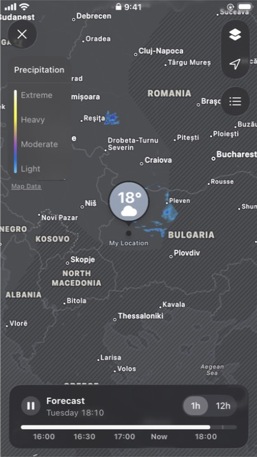

Сива основа, легенда за валежи и Forecast с 1h / 12h.

Запис: Precipitation layer selected from the Wind Map layer menu.

Време UTC: 2026-09-29T14:27:54.869Z. [Оригинален кадър](source-captures/04-layer-precipitation.jpg).

## 05. Temperature

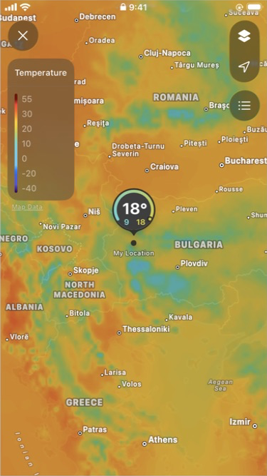

Цветен температурен слой без долна времева линия.

Запис: Temperature layer selected; wind timeline is replaced by temperature legend.

Време UTC: 2026-09-29T14:28:11.917Z. [Оригинален кадър](source-captures/05-layer-temperature.jpg).

## 06. Air Quality — Unavailable

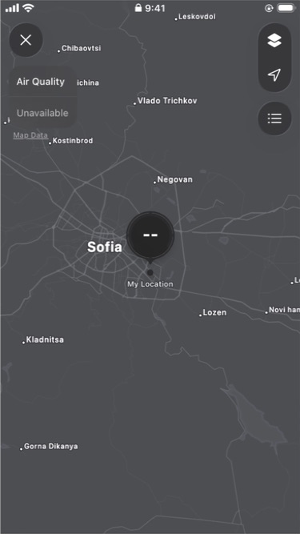

Наблюдавано липсващо покритие за Sofia, с маркер --.

Запис: Air Quality selected; Sofia shows Unavailable and a -- marker, with no timeline.

Време UTC: 2026-09-29T14:28:27.980Z. [Оригинален кадър](source-captures/06-layer-air-quality.jpg).

## 07. Wind при близък мащаб

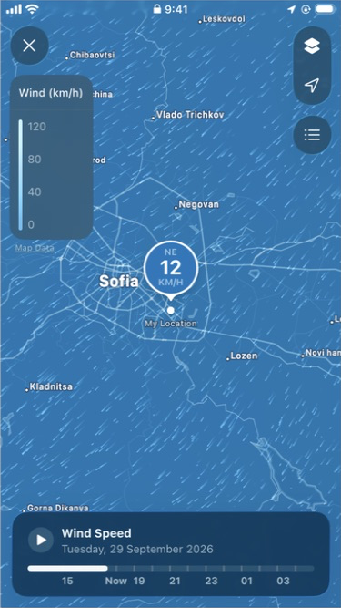

Връщане към Wind след Air Quality; близкият мащаб е запазен.

Запис: Wind layer restored after Air Quality; closer geographic scale around Sofia is retained.

Време UTC: 2026-09-29T14:28:44.120Z. [Оригинален кадър](source-captures/07-wind-close-scale.jpg).

## 08. Докосване на големия маркер

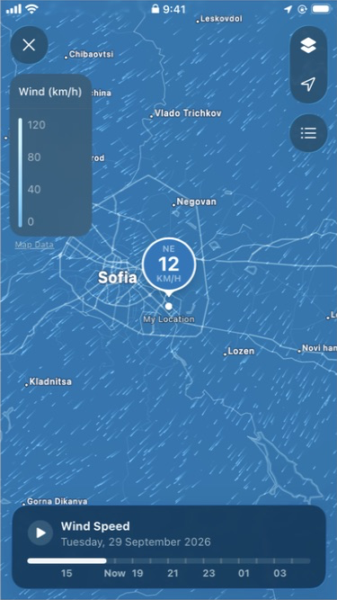

При този опит не се отвори допълнителен панел.

Запис: Single tap on the wind-speed bubble did not open a secondary sheet or change the visible layout.

Време UTC: 2026-09-29T14:28:48.906Z. [Оригинален кадър](source-captures/08-marker-tap-no-sheet.jpg).

## 09. Your Locations

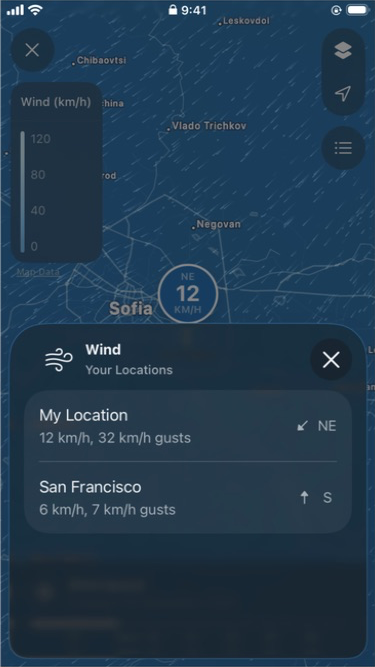

Име, скорост, пориви и посока за двете налични места.

Запис: Location-list button on full-screen wind map.

Време UTC: 2026-09-29T14:29:04.425Z. [Оригинален кадър](source-captures/09-locations-list.jpg).

## 10. Избран San Francisco

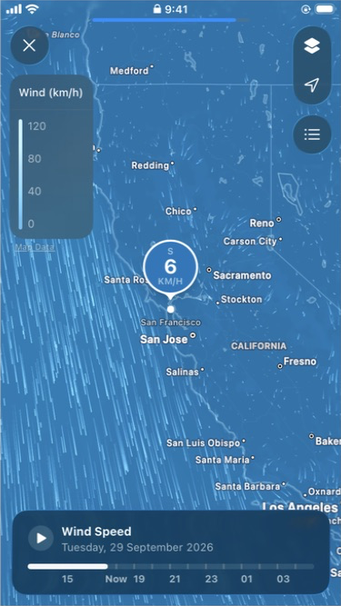

Изборът на ред премества картата към запазения град.

Запис: Selecting San Francisco from Your Locations moves the wind map to that saved city.

Време UTC: 2026-09-29T14:29:17.550Z. [Оригинален кадър](source-captures/10-selected-san-francisco.jpg).

## 11. Play е активиран

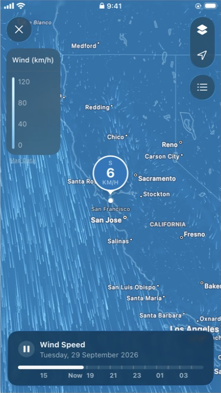

Бутонът показва Pause. Частиците и времевото възпроизвеждане са отделни поведения.

Запис: Play pressed on Wind Speed timeline; pause icon is visible. The subtitle shows a date, not a precise forecast hour.

Време UTC: 2026-09-29T14:29:26.330Z. [Оригинален кадър](source-captures/11-timeline-playing.jpg).

## 12. Pause е натиснат

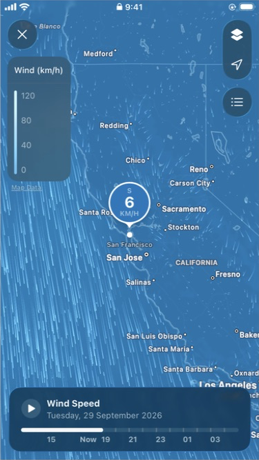

Бутонът отново показва Play.

Запис: Pause pressed; icon returns to play. Date stays Tuesday, 29 September 2026 in this capture.

Време UTC: 2026-09-29T14:29:32.187Z. [Оригинален кадър](source-captures/12-timeline-paused.jpg).

## 13. Преместване напред във времето

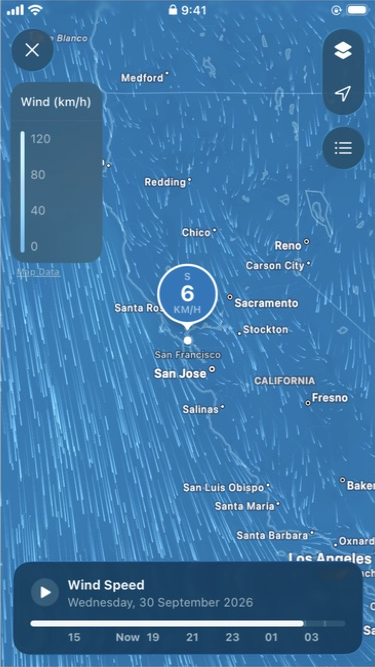

Белият прогрес е вдясно; датата преминава на 30 септември.

Запис: Dragged Wind Speed time track from current time towards the 03 tick.

Време UTC: 2026-09-29T14:29:37.327Z. [Оригинален кадър](source-captures/13-timeline-scrub-forward.jpg).

## 14. Начало на времевата линия

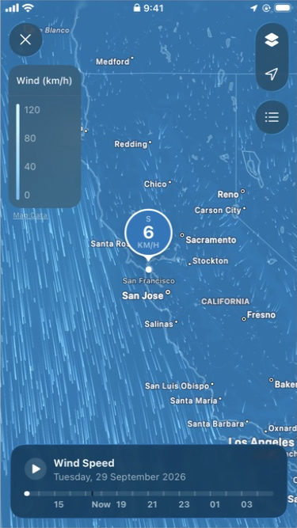

Докосване вляво; датата отново е 29 септември.

Запис: Tapped near left end of Wind Speed time track.

Време UTC: 2026-09-29T14:29:56.823Z. [Оригинален кадър](source-captures/14-timeline-start.jpg).

## 15. Центриране към My Location

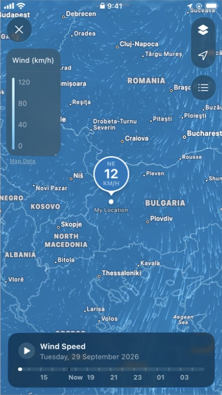

Стрелката връща картата от San Francisco към Sofia.

Запис: Tapped location arrow while map was at San Francisco; map returned to My Location around Sofia.

Време UTC: 2026-09-29T14:30:02.333Z. [Оригинален кадър](source-captures/15-location-recenter.jpg).

## 16. 16-scroll-input-no-pan

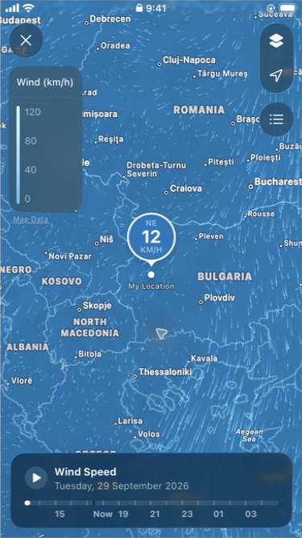

A vertical scroll input did not visibly move the map through iPhone Mirroring; see subsequent drag-pan capture.

Запис: A vertical scroll input did not visibly move the map through iPhone Mirroring; see subsequent drag-pan capture.

Време UTC: 2026-09-29T14:30:11.642Z. [Оригинален кадър](source-captures/16-scroll-input-no-pan.jpg).

## 17. Увеличение с двукратно докосване

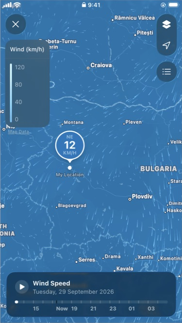

По-близък мащаб около докоснатата област.

Запис: Double-tapped near Bulgaria to test map zoom.

Време UTC: 2026-09-29T14:30:20.618Z. [Оригинален кадър](source-captures/17-map-double-tap-zoom.jpg).

## 18. Влачене на картата

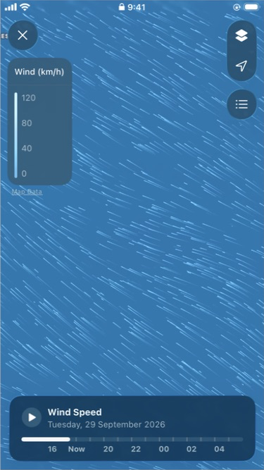

Географията се премества, а плаващите контроли остават фиксирани.

Запис: Dragged the map canvas diagonally; geographic content moves while overlays remain fixed.

Време UTC: 2026-09-29T14:31:23.368Z. [Оригинален кадър](source-captures/18-map-drag-pan.jpg).

## 19. Опит с Map Data

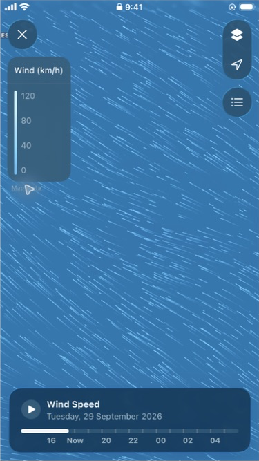

Не се отвори страница с източници; не приемаме предполагаем резултат за потвърден.

Запис: First tap on the Map Data label did not produce a visible change.

Време UTC: 2026-09-29T14:31:36.617Z. [Оригинален кадър](source-captures/19-map-data-tap-no-page.jpg).

## 20. 20-timeline-hidden-after-label-taps

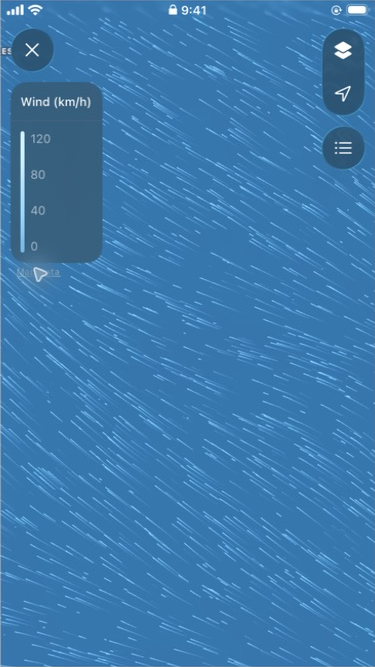

After repeated taps around Map Data, the bottom timeline became hidden; no attribution page appeared. Trigger is not isolated.

Запис: After repeated taps around Map Data, the bottom timeline became hidden; no attribution page appeared. Trigger is not isolated.

Време UTC: 2026-09-29T14:32:01.011Z. [Оригинален кадър](source-captures/20-timeline-hidden-after-label-taps.jpg).

## 21. Скрита времева линия

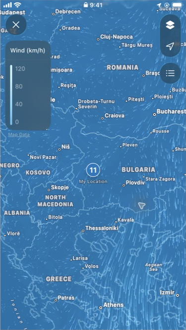

Докосване на свободна област скрива долния панел. Маркерът е компактен.

Запис: Single tap on an empty map area hid the bottom Wind Speed panel and collapsed the large wind bubble to a small value marker. Top controls and legend remained visible.

Време UTC: 2026-09-29T14:32:37.369Z. [Оригинален кадър](source-captures/21-map-tap-timeline-hidden.jpg).

## 22. Върната времева линия

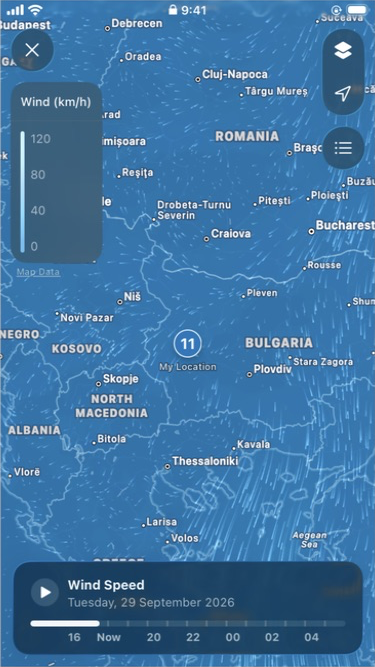

Следващо докосване връща панела; маркерът остава компактен.

Запис: Second single tap on the same empty map area restored the Wind Speed timeline. The location marker remained compact.

Време UTC: 2026-09-29T14:32:49.541Z. [Оригинален кадър](source-captures/22-map-tap-timeline-restored.jpg).

## 23. Връщане от пълен екран

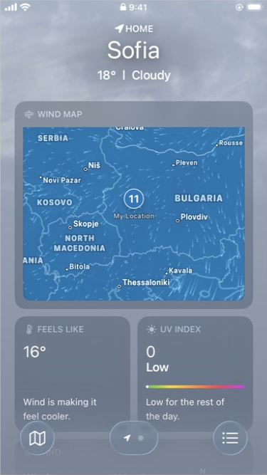

Бутонът × връща прогнозата; картичката е частично изрязана от горната фиксирана област.

Запис: Close X returns to the forecast with the embedded Wind Map visible; the card is partly clipped beneath the sticky weather header at this scroll offset.

Време UTC: 2026-09-29T14:33:37.436Z. [Оригинален кадър](source-captures/23-inline-after-close.jpg).

## 24. Картичка при скролиране

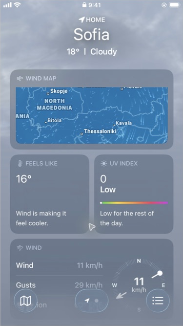

Намалена видима част на картата; отделната Wind картичка се вижда по-надолу.

Запис: Scrolling forecast upwards through content clips the Wind Map card beneath the sticky Sofia header; separate numeric Wind card is visible below.

Време UTC: 2026-09-29T14:33:59.927Z. [Оригинален кадър](source-captures/24-inline-scroll-clipping.jpg).

## 25. 25-inline-complete-card

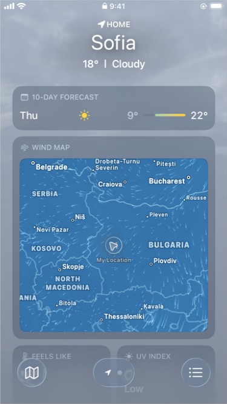

Wind Map card fully visible after scrolling back up, with current wind marker 11 km/h.

Запис: Wind Map card fully visible after scrolling back up, with current wind marker 11 km/h.

Време UTC: 2026-09-29T14:34:27.853Z. [Оригинален кадър](source-captures/25-inline-complete-card.jpg).

## 26. Картичка в прогнозата

Цялата Wind Map картичка, компактен маркер и околният интерфейс.

Запис: Final unobstructed embedded Wind Map card.

Време UTC: 2026-09-29T14:34:56.566Z. [Оригинален кадър](source-captures/26-inline-clean.jpg).

## 27. Пълен екран

Легенда, слоеве, местоположение, списък и долен панел Wind Speed.

Запис: Final full-screen Wind Map at My Location with timeline visible and playback paused.

Време UTC: 2026-09-29T14:35:08.218Z. [Оригинален кадър](source-captures/27-fullscreen-clean.jpg).
